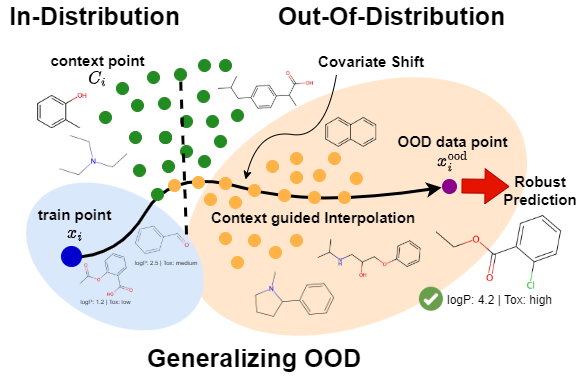
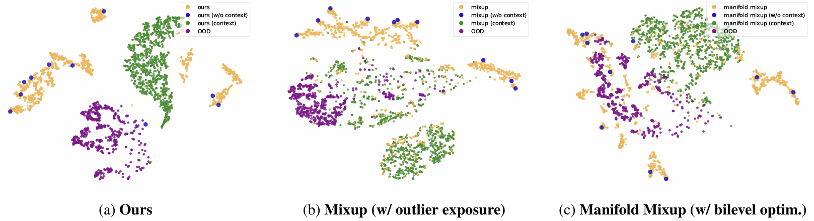

# Robust Molecular Property Prediction via Densifying Scarce Labeled Data

Official implementation of **[_Robust Molecular Property Prediction via Densifying Scarce Labeled Data_](https://openreview.net/forum?id=UF3Iq9cd3W) [[arXiv]](https://arxiv.org/abs/2506.11877)**.

> 🏫 [Jina Kim*](https://jina0218.github.io/), 🏫 [Jeffery Willette*](https://jeffwillette.github.io/), 🏫 [Bruno Andreis*](https://andreisbruno.github.io/), 🤖 [Sung Ju Hwang](http://www.sungjuhwang.com/)  
> *Equal contribution  
> 🏫 [KAIST](https://www.kaist.ac.kr/en/), 🤖 [DeepAuto.ai](http://deepauto.ai/)  
> 📍 Accepted at [GenBio Workshop @ ICML 2025](https://genbio-workshop.github.io/2025/)


## 🧬 Overview



We address the challenge of molecular property prediction under **covariate shift**—a major obstacle in real-world drug discovery. Our method improves generalization to **out-of-distribution (OOD)** molecules by **densifying scarce labeled data** through the use of **domain-informed unlabeled data** and a **meta-learning framework with bilevel optimization**.


## 🧾 Abstract

A widely recognized limitation of molecular prediction models is their reliance on structures observed in the training data, resulting in poor generalization to out-of-distribution compounds. Yet in drug discovery, the compounds most critical for advancing research often lie beyond the training set, making the bias toward the training data particularly problematic. This mismatch introduces substantial **covariate shift**, under which standard deep learning models produce unstable and inaccurate predictions. Furthermore, the scarcity of labeled data—stemming from the onerous and costly nature of experimental validation—further exacerbates the difficulty of achieving reliable generalization. To address these limitations, we propose a novel **meta-learning-based approach** that leverages **unlabeled data** to interpolate between in-distribution (ID) and out-of-distribution (OOD) data, enabling the model to meta-learn how to generalize beyond the training distribution. We demonstrate significant performance gains over state-of-the-art methods on challenging real-world datasets that exhibit substantial covariate shift.


## 📊 Results


We benchmark our method on the [Merck Molecular Activity Challenge (Merck)](https://www.kaggle.com/c/MerckActivity/data), which contains 15 datasets exhibiting real-world **covariate shifts** in molecular property prediction. Following [Q-SAVI](https://proceedings.mlr.press/v202/klarner23a/klarner23a.pdf), we focus on the three most challenging targets: **HIVPROT**, **DPP4**, and **NK1**, each evaluated using both **count vector** and **bit vector** molecular encodings.

> 📌 Detailed implementation notes for Mixup and Manifold Mixup variants are available in **Appendix A.1**.


## 🌀 t-SNE Analysis



We visualize the learned feature representations using **t-SNE** to qualitatively assess generalization under covariate shift.

- **Ours** produces well-separated clusters for in-distribution, context, and OOD samples, indicating **clear structure** and **robust latent features**.
- In contrast, **Mixup (w/ outlier exposure)** and **Manifold Mixup (w/ bilevel optim.)** exhibit overlapping clusters, suggesting degraded OOD discrimination and less effective generalization.

> 📌 More t-SNE visualizations and further details can be found in **Appendix B**.

## 🧩 Key Contributions

- **Context-Guided Interpolation**: We introduce a learnable set function (e.g., DeepSets or Set Transformer) that interpolates labeled training data with unlabeled external context points to improve representation quality.

- **Bilevel Optimization**: We employ a meta-learning framework where interpolation is guided by a meta-validation loss with pseudo-labels, enabling better generalization to unseen distributions.

- **Effective Densification**: Our approach densifies sparse regions of the training distribution by leveraging unlabeled molecules to learn more robust and structured latent representations.

- **Robust OOD Generalization**: Our method consistently outperforms state-of-the-art baselines on the Merck Molecular Activity Challenge, demonstrating strong resilience under significant covariate shift.

- **Model Interpretability via t-SNE**: We provide qualitative insights into model behavior through t-SNE visualizations, which reveal that our method produces well-separated and structured latent spaces compared to baselines like Mixup and Manifold Mixup.

## 🔁 How to reproduce

### 1. 🛠 Installation

Clone the repository and install the required Python packages:

```sh
git clone https://github.com/JinA0218/drugood-densify.git
cd drugood-densify
pip install -r requirements.txt
```

### 2. 🧪 Merck Experiment (Table 1)

| Model Variant                          | Hyperparameter Tuning Script Path                                                   | Test Result Script Path                                               |
|----------------------------------------|--------------------------------------------------------------------------------------|------------------------------------------------------------------------|
| **Ours (Deepsets)**                    | `scripts/hyper_tuning/cmixer_dsets_hp_sweep_final_n_mvalid.sh`                      | `scripts/final_report/final_n_mvalid_ours.sh`                         |
| **Ours (Set Trans.)**                  | `scripts/hyper_tuning/cmixer_strans_hp_sweep_final_n_mvalid.sh`                     | `scripts/final_report/final_n_mvalid_ours.sh`                         |
| **Mixup**                              | `scripts/hyper_tuning/cmixer_dsets_hp_sweep_final_n_mvalid_mixup.sh`                | `scripts/hyper_tuning/final_n_mvalid_mixup.sh`                        |
| **Mixup (w/ outlier exposure)**        | `scripts/hyper_tuning/cmixer_dsets_hp_sweep_final_n_mvalid_mixup_bilevel.sh`        | `scripts/hyper_tuning/final_n_mvalid_mixup_bilevel.sh`               |
| **Manifold Mixup**                     | `scripts/hyper_tuning/cmixer_dsets_hp_sweep_final_n_mvalid_manmixup.sh`             | `scripts/hyper_tuning/final_n_mvalid_manmixup.sh`                    |
| **Manifold Mixup (w/ bilevel)**        | `scripts/hyper_tuning/cmixer_dsets_hp_sweep_final_n_mvalid_manmixup_bilevel.sh`     | `scripts/hyper_tuning/final_n_mvalid_manmixup_bilevel.sh`            |

> 🔧 Implementation details for Mixup and Manifold Mixup variants are provided in **Appendix A.1**.
> 
> 🔍 Hyperparameter search ranges are defined in the files located under `src/model/`, and the specific values used in our experiments are described in **Appendix A.3**.
> 
> 📊 **Results**: Final test results are saved under `experiments/results/`, and performance logs from hyperparameter tuning are stored in the `experiments/` directory.

### 3. 🧪 Ablation Study (Table 2)

| Model Variant             | Settings                                 | Hyperparameter Tuning Script Path                                                   | Test Result Script Path                                                           |
|--------------------------|------------------------------------------|--------------------------------------------------------------------------------------|-----------------------------------------------------------------------------------|
| **Ours (Deepsets)**      | ✅ ctx, ❌ bilevel, 🎲 rand               | `scripts/hyper_tuning/cmixer_dsets_strans_hp_sweep_final_n_mvalid_no_bilevel.sh`    | `scripts/final_report/final_n_mvalid_ours_no_bilevel.sh`                          |
| **Ours (Set Trans.)**    | ✅ ctx, ❌ bilevel, 🎲 rand               | `scripts/hyper_tuning/cmixer_dsets_strans_hp_sweep_final_n_mvalid_no_bilevel.sh`    | `scripts/final_report/final_n_mvalid_ours_no_bilevel.sh`                          |
| **Ours (MLP)**           | ❌ ctx, ❌ bilevel, 🎲 rand               | `scripts/hyper_tuning/cmixer_dsets_hp_sweep_final_n_mvalid_mlp.sh`                  | `scripts/final_report/final_n_mvalid_ours_mlp.sh`                                 |
| **Ours (Deepsets)**      | ✅ ctx, ✅ bilevel, 📈 real              | `scripts/hyper_tuning/cmixer_dsets_strans_hp_sweep_final_n_mvalid_realy.sh`         | `scripts/final_report/final_n_mvalid_ours_realy.sh`                               |
| **Ours (Set Trans.)**    | ✅ ctx, ✅ bilevel, 📈 real              | `scripts/hyper_tuning/cmixer_dsets_strans_hp_sweep_final_n_mvalid_realy.sh`         | `scripts/final_report/final_n_mvalid_ours_realy.sh`                               |

> 🔧 Implementation details for each ablation study variant are provided in **Appendix A.2**.
> 
> 🔍 Hyperparameter search ranges are defined in the files located under `src/model/`, and the specific values used in our experiments can be found in **Appendix A.3**.
> 
> 📊 **Results**: Final test results are saved under `experiments/results/`, and performance logs from hyperparameter tuning are stored in the `experiments/` directory.

### 4. 📉 t-SNE Visualization

Scripts for generating t-SNE visualizations are located in `scripts/plot_tsne/`:

- **(a) Ours**: [`test_context_lastlayer_random_y_mNctFalse.ipynb`](scripts/plot_tsne/test_context_lastlayer_random_y_mNctFalse.ipynb)  
- **(b) Mixup (w/ outlier exposure)**: [`test_context_lastlayer_random_y_mNctFalse_MIXUP_BILEVEL.ipynb`](scripts/plot_tsne/test_context_lastlayer_random_y_mNctFalse_MIXUP_BILEVEL.ipynb)  
- **(c) Manifold Mixup (w/ bilevel optim.)**: [`test_context_lastlayer_random_y_mNctFalse_MANMIXUP_BILEVEL.ipynb`](scripts/plot_tsne/test_context_lastlayer_random_y_mNctFalse_MANMIXUP_BILEVEL.ipynb)

To save the corresponding model checkpoints for visualization, set `SAVE_TSNE_MODEL=1` in the following training scripts:

- **(a) Ours**: `scripts/final_report/final_n_mvalid_ours.sh`  
- **(b) Mixup (w/ outlier exposure)**: `scripts/final_report/final_n_mvalid_mixup.sh`  
- **(c) Manifold Mixup (w/ bilevel optim.)**: `scripts/final_report/final_n_mvalid_manmixup.sh`

Example model checkpoint directories:

- **(a) Ours**: `tsne_model/tsne_model2_mNctFalse_RYV1_mixTrue/`  
- **(b) Mixup (w/ outlier exposure)**: `tsne_model/tsne_model2_mNctFalse_RYV1_mixTrue_MIXUP_BILEVEL/`  
- **(c) Manifold Mixup (w/ bilevel optim.)**: `tsne_model/tsne_model2_mNctFalse_RYV1_mixTrue_MANIFOLD_MIXUP_BILEVEL/`


## 📚 Citation

```BibTeX
@misc{kim2025robustmolecularpropertyprediction,
      title={Robust Molecular Property Prediction via Densifying Scarce Labeled Data}, 
      author={Jina Kim and Jeffrey Willette and Bruno Andreis and Sung Ju Hwang},
      year={2025},
      eprint={2506.11877},
      archivePrefix={arXiv},
      primaryClass={cs.LG},
      url={https://arxiv.org/abs/2506.11877}, 
}
```
