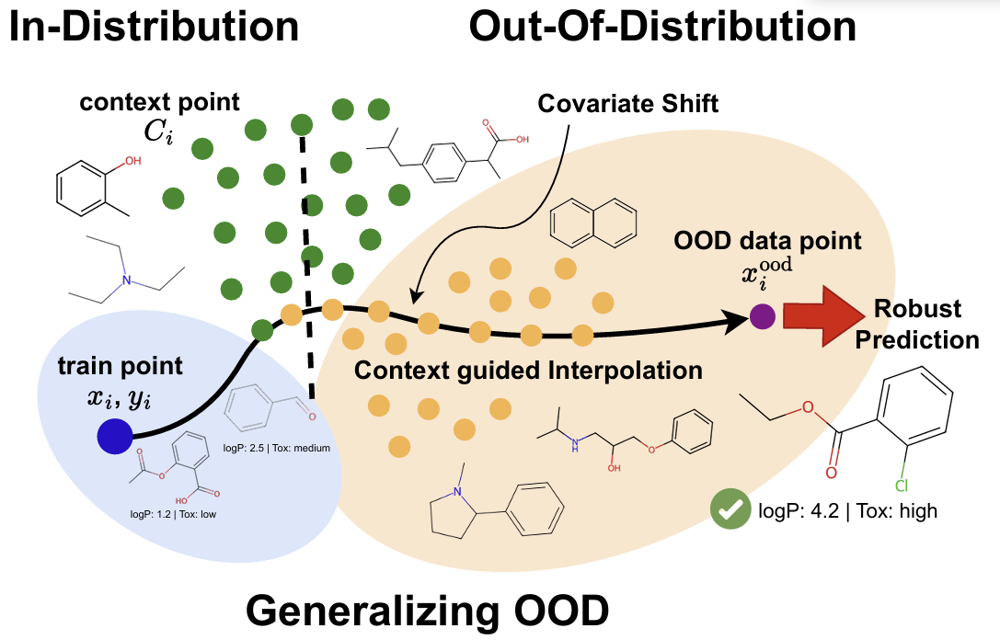

# Robust Molecular Property Prediction via Densifying Scarce Labeled Data

This repository inlcudes official implementations for [Robust Molecular Property Prediction via Densifying Scarce Labeled Data](https://openreview.net/forum?id=UF3Iq9cd3W) [[Paper]](https://arxiv.org/abs/2506.11877).

> **[Robust Molecular Property Prediction via Densifying Scarce Labeled Data](https://arxiv.org/abs/2506.11877)**<br>
> :school:[Jina Kim*](https://jina0218.github.io/), :school:[Jeffery Willette*](https://jeffwillette.github.io/), :school:[Bruno Andreis*](https://andreisbruno.github.io/), :school::robot:[Sung Ju Hwang](http://www.sungjuhwang.com/) <br>
> *Equal Contribution
> KAIST :school:, [DeepAuto.ai](http://deepauto.ai/):robot:<br>
> [GenBio ICML Workshop 2025](https://genbio-workshop.github.io/2025/)

## Overview



We address the challenge of molecular property prediction under covariate shift—a major hurdle in real-world drug discovery. Our method enhances generalization to out-of-distribution (OOD) molecules by densifying scarce labeled data using domain-informed unlabeled data and meta-learning with bilevel optimization.

## Abstract

A widely recognized limitation of molecular prediction models is their reliance on structures observed in the training data, resulting in poor generalization to out-of-distribution compounds. Yet in drug discovery, the compounds most critical for advancing research often lie beyond the training set, making the bias toward the training data particularly problematic. This mismatch introduces substantial covariate shift, under which standard deep learning models produce unstable and inaccurate predictions. Furthermore, the scarcity of labeled data—stemming from the onerous and costly nature of experimental validation—further exacerbates the difficulty of achieving reliable generalization. To address these limitations, we propose a novel meta-learning-based approach that leverages unlabeled data to interpolate between in-distribution (ID) and out-of-distribution (OOD) data, enabling the model to meta-learn how to generalize beyond the training distribution. We demonstrate significant performance gains over state-of-the-art methods on challenging real-world datasets that exhibit substantial covariate shift.

## Results


We benchmark our method on the [Merck Molecular Activity Challenge](https://www.kaggle.com/c/MerckActivity/data), which contains 15 datasets with real-world covariate shifts in molecular property prediction. Following [Q-SAVI](https://proceedings.mlr.press/v202/klarner23a/klarner23a.pdf), we focus on three most challenging targets: HIVPROT, DPP4, and NK1, each evaluated with both count vector and bit vector encodings.

Our model achieves up to 65% MSE reduction over baselines on the HIVPROT dataset—one of the hardest OOD shifts—demonstrating significant robustness under covariate shift.

## t-SNE Analysis


We visualize the learned feature representations using t-SNE to qualitatively assess generalization:
- Ours produces well-separated clusters for in-distribution, context, and OOD samples—indicating clear structure and robust latent features.

- Baselines such as Mixup and Manifold Mixup show overlapping clusters, suggesting degraded OOD discrimination.

## Key Contribution
- **Context-guided Interpolation**: We introduce a learnable set function (e.g., DeepSets or Set Transformer) that interpolates labeled training data with unlabeled external context points.

- **Bilevel Optimization**: A meta-learning setup ensures that the interpolation improves generalization to unseen distributions using a meta-validation loss with pseudo-labels.

- **Effective Densification**: The method densifies sparse training regions by learning structured latent representations guided by unlabeled molecules.

- **Robust OOD Generalization**: Outperforms state-of-the-art methods on the Merck Molecular Activity Challenge datasets with significant covariate shift.

## How to reproduce

### 1. Installation

```sh 
git clone https://github.com/JinA0218/drugood-densify
cd drugood-densify
pip install -r requirements.txt
```

### 2. Hyperparameter Tuning

### 3. Ablation Study

### 4. t-SNE visualization

## Citation

```BibTeX
@misc{kim2025robustmolecularpropertyprediction,
      title={Robust Molecular Property Prediction via Densifying Scarce Labeled Data}, 
      author={Jina Kim and Jeffrey Willette and Bruno Andreis and Sung Ju Hwang},
      year={2025},
      eprint={2506.11877},
      archivePrefix={arXiv},
      primaryClass={cs.LG},
      url={https://arxiv.org/abs/2506.11877}, 
}
```